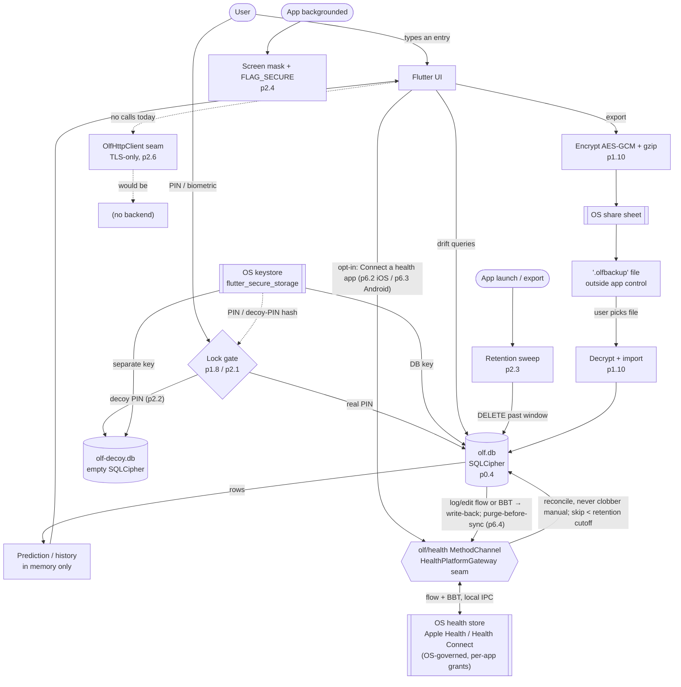

# Threat model & data-flow (p2.8)

`requirements.md` §3 (privacy & data security), §7 (duress / coercion), §8
(accessibility of the security model — it has to be understandable). This is a
**living document**: it is reviewed at every phase gate and the review is
recorded in the [Review log](#review-log) at the end. A CI guard
(`core/test/threat_model_doc_test.dart`) fails the build if this file loses a
required section, its Mermaid diagram, or a Review-log entry for the current
phase.

olf is a **local-only, no-account** cycle tracker. There is no backend, no
sign-in, and no network traffic today (the transport-security baseline in p2.6
is groundwork for a *possible* future sync). That single architectural choice
removes most of the classic attack surface — there is no server to breach, no
account to phish, no traffic to intercept — and concentrates what remains on
**the device itself**.

---

## Assets

What an adversary would want, roughly in order of sensitivity.

| Asset | Where it lives | Why it matters |
|---|---|---|
| Cycle & health entries (periods, flow, symptoms, BBT, mucus, meds, pregnancy-loss / birth events) | `olf.db`, an SQLCipher-encrypted drift database in app-private storage | The core secret. Can imply pregnancy, pregnancy loss, contraception use, sexual activity, transition-related care. |
| The database encryption key | OS keystore via `flutter_secure_storage` (Android Keystore / iOS Keychain), never in the DB or prefs | Whoever has this can read `olf.db` directly, no PIN needed. |
| PIN hash and decoy-PIN hash | `flutter_secure_storage` | Brute-forcing these bypasses the gate; the decoy hash also reveals that a decoy exists. |
| Preferences (theme, pronouns, reminder settings, retention window) | unencrypted `SharedPreferences` / `NSUserDefaults` | Low sensitivity on their own, but pronouns and a tight retention window are weak signals. |
| `.olfbackup` export files | wherever the user saved them via the OS share sheet — local disk, cloud drive, messaging app | Encrypted (AES-GCM, user passphrase), but now outside app control. |
| `olf-report-YYYY-MM-DD.pdf` doctor-report files (p6.5) | wherever the user saved them via the OS file picker | **Plaintext** — a human-readable summary of cycles, symptoms, BBT and pregnancy-loss / birth events, meant to be handed to a clinician. Neutral filename, no name/identifier. Retention-trimmed (purge-before-export). Outside app control once saved. |
| Derived predictions (next period, fertile window) | recomputed in memory from entries; not separately stored | Same sensitivity as the entries they come from. |
| Menstrual-flow & basal-body-temperature samples in the **OS health store** — Apple Health on iOS (p6.2), Android Health Connect on Android (p6.3) | the platform's own encrypted store, reached over local IPC only when the user has turned on "Connect a health app" | Same sensitivity as the olf entries — but now also readable by any *other* app the user has granted the same health permissions, and governed by the OS's sharing UI rather than olf's. Default off. |
| Source repository & dependency graph | GitHub, `pubspec.lock` | A malicious dependency could exfiltrate any of the above from a future build. |

---

## Adversaries

| Adversary | Capability | In scope? |
|---|---|---|
| **Opportunistic snoop** | Picks up an unlocked, unattended phone for a minute. | Yes — the PIN/biometric gate (p1.8, p2.1) is the primary control. |
| **Coercing party** | Can compel the owner to unlock the phone or hand over the PIN (border, abusive partner, custody dispute). | Yes — the decoy PIN (p2.2) and the retention window (p2.3) are the controls. |
| **Device co-owner / abuser** | Shares the device day-to-day, may install things, watches over the owner's shoulder. | Yes — discreet theme (p1.9), background mask (p2.4), no PHI in notifications (p1.7 / §3), decoy vault (p2.2). |
| **Thief / finder** | Has the powered-off or locked device, no compulsion. | Yes — at-rest encryption (p0.4) + OS lock + the app gate. |
| **Another app / malware on the device** | Runs unprivileged in its own sandbox; may try the recents screenshot buffer, `MediaProjection`, or reading world-readable files. | Partly — `FLAG_SECURE` + the app-switcher mask (p2.4), app-private storage, key in the keystore. A rooted/jailbroken device is out of scope. |
| **Network attacker** | On-path for a future sync call; MITM proxy, hostile Wi-Fi. | Pre-mitigated — no traffic today; TLS-only config + `OlfHttpClient` chokepoint (p2.6) so the first sync inherits a hardened default. |
| **Supply-chain attacker** | Gets a malicious package (or version) into the dependency graph. | Yes — the CI dependency-audit denylist + locked graph (p0.3), promoted to an un-waivable release blocker in p2.9. |
| **Legal process** | Subpoena / warrant to the developer or a civil discovery request. | Yes — there is no account, log, or server-side copy to produce; the privacy policy (p2.5) and the in-app explainer (p2.7) state this plainly. |

**Explicitly out of scope:** a nation-state adversary with a zero-day against
the OS or the secure enclave; a forensic lab with chip-off / JTAG access to a
seized device; a compromised OS or a rooted/jailbroken device (the keystore and
`FLAG_SECURE` guarantees no longer hold); rubber-hose attacks that go past the
decoy (the owner is compelled to reveal that a decoy exists). These are noted
so the boundary is honest, not because they are unimportant.

---

## Trust boundaries

1. **OS keystore ↔ app process.** The app asks the keystore to create/return
   the DB key; it trusts the OS to gate that on device unlock and to keep the
   key out of other apps. Crossing point: `flutter_secure_storage`.
2. **App process ↔ `olf.db` on disk.** In-process the data is plaintext; on
   disk it is SQLCipher-encrypted. Crossing point: the drift/SQLCipher layer
   (p0.4).
3. **Locked app ↔ unlocked app.** The PIN/biometric gate (p1.8, p2.1) runs
   *before* the database is opened; the decoy PIN (p2.2) routes to a physically
   separate database file. Crossing point: the lock screen + vault selection.
4. **App ↔ OS share sheet / file picker.** Export hands a file to the OS —
   an encrypted `.olfbackup` blob (p1.10) or a **plaintext** `olf-report-*.pdf`
   doctor report (p6.5); restore reads a user-chosen file. Once written, the
   file is outside olf's control. Crossing point: the `BackupFileGateway` seam
   (`saveFile`), shared by both (p1.10, p6.5). The report is deliberately
   plaintext — it exists to be read by a clinician — so the mitigation is the
   user's own deliberate save action, a neutral filename with no identifier, and
   the retention window applied before the file is built.
5. **App ↔ screen / recents buffer.** When the app is backgrounded or
   inactive, the OS may snapshot the screen. Crossing point: the lifecycle
   listener + `FLAG_SECURE` / native cover (p2.4).
6. **App ↔ network.** No traffic today. The only sanctioned path is
   `OlfHttpClient` (p2.6), which refuses non-HTTPS before a socket opens.
7. **Repo ↔ dependency graph.** Every transitive package is trusted at build
   time. Crossing point: `pubspec.lock` + the CI dependency-audit (p0.3, p2.9).
8. **App ↔ OS health platform, both OSes (p6.2 iOS, p6.3 Android).** When — and
   only when — the user turns on "Connect a health app", olf reads and writes
   menstrual flow and basal body temperature to the OS health store over a
   **local IPC** channel: the hand-rolled `olf/health` `MethodChannel` →
   HealthKit on iOS (no CocoaPod), → Android Health Connect on Android (the
   `androidx.health.connect:connect-client` Gradle dependency, **not** a pub
   package — `pubspec.lock` unchanged). No network on either side. What crosses
   is scoped to those two types; the user grants and revokes it in the OS health
   settings (the iOS Health app / Health Connect), and olf treats a revoked /
   empty read as "nothing to import", never an error. Crossing point: the `core`
   `HealthPlatformGateway` seam and its `HealthKitGateway` (iOS) /
   `HealthConnectGateway` (Android) implementations. The Android manifest gains
   exactly four `android.permission.health.*` entries (read + write for the two
   wired types, each `audited:`), a Health Connect permissions-rationale
   `<intent-filter>`, and one `<queries><package>` for provider visibility;
   `minSdk` rises 24 → 26 to match what `connect-client` needs (olf already
   documents "Android 8+ / API 26+" as its minimum — this only aligns the
   actual config). Not present where the gateway binds to
   `UnavailableHealthGateway` (desktop, web, tests).

---

## Data flow



ASCII fallback (same flow, for viewers without Mermaid):

```
              +-----------+     PIN / biometric      +----------------------+
   User  ---> | Flutter UI| ---> [ Lock gate ] ---->  |  real PIN            |
              +-----------+       p1.8 / p2.1         |    -> olf.db         |
                   |  ^                               |       (SQLCipher,p0.4)
        drift      |  | predictions (in memory)       |  decoy PIN (p2.2)    |
        queries    v  |                               |    -> olf-decoy.db   |
              +----------------+                      +----------------------+
              |  olf.db        | <--- DB key --- [ OS keystore / secure storage ]
              +----------------+                       (also holds PIN hashes)
                   |   ^
   launch/export   |   | import
   [ retention     |   |
     sweep p2.3 ]--+   |
                   |   |
             export v  | 
        [ encrypt AES-GCM + gzip, p1.10 ] --> [ OS share sheet ] --> .olfbackup
                                                                     (outside app)
   app backgrounded --> [ screen mask + FLAG_SECURE, p2.4 ]

   network: none today. Only path = OlfHttpClient (TLS-only, p2.6) --> (no backend)

   health platform (p6.2 iOS / p6.3 Android, opt-in, default off):
     [ Flutter UI ] <--> [ olf/health MethodChannel = HealthPlatformGateway ]
                          <--> [ OS health store: Apple Health / Health Connect ]  (flow + BBT, local IPC)
                     import --> [ ImportReconciler ] --> olf.db  (never clobbers a manual row)
                     write-back (p6.4): olf.db edit --> [ olf/health ] --> OS health store
                       (externalId round-tripped so no duplicate; both directions skip
                        entries older than the p2.3 retention cutoff — purge-before-sync)
```

---

## Mitigations

Every privacy/security control shipped in Phases 0–2, mapped to the slice that
introduced it and the boundary or adversary it addresses. This table is the
cross-reference the phase-gate review walks.

| Control | Slice | Addresses |
|---|---|---|
| No account, no sign-in, local-only store | p0.4 | removes server breach / account phishing / subpoena-to-server entirely |
| SQLCipher encryption at rest | p0.4 | thief / finder; another app reading files |
| CI dependency-audit denylist + locked graph + branch protection | p0.3 | supply-chain attacker; enforces "zero ad/analytics SDK" (§3) |
| Anonymous-by-default + local PIN gate + disclaimers + first-run privacy explainer | p1.8 | opportunistic snoop; sets user expectations honestly (§6) |
| Discreet dark theme baseline | p1.9 | shoulder-surfing co-owner |
| Encrypted backup / restore (`.olfbackup`, AES-GCM + gzip, user passphrase) | p1.10 | keeps the export secret once it leaves the app |
| No PHI in reminder notification text | p1.7 / §3 | notifications visible on a locked screen |
| Biometric unlock layered on the PIN | p2.1 | faster gate → users actually keep it on |
| Decoy / duress PIN → separate empty vault | p2.2 | coercing party; border / custody compulsion (§7) |
| Scheduled auto-deletion (retention window + purge-before-export) | p2.3 | limits what a seized device can reveal; "delete means delete" (§9(11)) |
| Doctor report: on-device only, neutral filename, purge-before-export, "not a medical device" disclaimer on the page, retention exclusion stated when it applies | p6.5 | user-initiated plaintext egress — same class as the p1.10 backup; keeps the export deliberate, unlinkable by filename, and honest about gaps |
| Background app-switcher mask + `FLAG_SECURE` + no-PHI recents | p2.4 | another app / `MediaProjection`; recents snapshot |
| Standalone consumer-health privacy policy + opt-in consent switches (default off) | p2.5 | MHMDA / Nevada SB370 alignment; "we never sell / require legal process" (§3, §6) |
| TLS-only platform config + `OlfHttpClient` chokepoint + transport gate | p2.6 | future network attacker; prevents a later feature silently using cleartext |
| In-app privacy education (HIPAA gap, law-enforcement reality, how to delete everything) | p2.7 | the ~9%-take-action finding; corrects the "HIPAA covers this" misconception (§3, §9(8)) |
| This threat model + its CI guard | p2.8 | keeps the security design written down and reviewed each phase |
| Health-platform bridge is opt-in / default-off / revocable, scoped to exactly two data types, hand-rolled channel (no SDK, no CocoaPod), no network; imported rows land in the same `bbt_entries` / `daily_flows` tables the p2.3 retention sweep already covers | p6.2 | the new App ↔ OS health platform boundary (#8) — minimises what crosses it and keeps the user in control of when it is open |
| Android half of the same bridge hand-rolled in Kotlin against Health Connect — the manifest carries **exactly four** `android.permission.health.*` entries (read + write for the two wired types, each `audited:` and checked by the dependency-audit permission-diff), no pub package (`pubspec.lock` unchanged), no network; runtime `getSdkStatus` probe hides the tile when Health Connect is absent | p6.3 | extends boundary #8 to Android with the same minimal, user-controlled, auditable surface as iOS |

---

## Residual risks

Known gaps, carried from the per-slice `§9` follow-up notes in
`docs/plan/backlog.md`. None block Phase 2; each is a candidate for a later
hardening slice.

- **The DB key is not bound to the PIN.** Each vault's SQLCipher key sits in
  secure storage independent of its PIN. An attacker with a secure-storage dump
  does not need the PIN; an attacker with the decoy PIN still cannot reach the
  real key. Binding the key to the PIN with a real KDF is the open item
  (p1.8 / p2.1 / p2.2 carry-over).
- **No failed-attempt lockout or backoff** on the PIN or the biometric retry
  (p2.1 / p2.2).
- **PIN hashing runs on the main isolate** at a modest work factor (p1.8).
- **iOS screenshots and screen recordings are not blocked** — no OS API; only
  the app-switcher snapshot is covered (p2.4).
- **Turning the decoy PIN off leaves `olf-decoy.db` on disk**, just unreachable;
  there is no "wipe the decoy space" action (p2.2).
- **The decoy vault opens with default preferences**, which a heavily
  customised real app might contrast with (p2.2).
- **Already-saved `.olfbackup` files and `olf-report-*.pdf` doctor reports are
  not retro-scrubbed** by the retention sweep — the app keeps no registry of
  where exports were saved (p2.3, p6.5, §9(11)). The report is plaintext by
  design; once the user has saved and shared it, its contents are wherever they
  put it.
- **No background/periodic retention sweep** — it runs on launch, window
  change, and before export only (p2.3).
- **Certificate pinning is designed, not enforced** — `OlfHttpClient
  .certificatePins` is empty and `_checkPins` throws for any host added to it,
  so the first real backend host must wire enforcement (p2.6).
- **The delete explainer describes uninstall but cannot perform it** — there is
  no in-app "wipe everything now" button (p2.7).
- **Out-of-scope adversaries** (nation-state OS 0-day, forensic chip-off,
  rooted device, rubber-hose past the decoy) are accepted, not mitigated.

---

## Review log

Each phase gate: walk the [Mitigations](#mitigations) table against what
shipped, refresh [Residual risks](#residual-risks), and add a dated line here.
The CI guard requires an entry naming the current phase.

- **2026-08-31 — Phase 2 gate — reviewer: worker: phase2.** Initial version.
  Assets, adversaries, trust boundaries, and the data-flow diagram reflect the
  architecture as of `a7585fe` (Phase 0 + Phase 1 + p2.1–p2.7 merged; p2.8 in
  review). Every Phase 0–2 privacy/security control is cross-referenced to its
  slice in the Mitigations table. Residual risks seeded from the per-slice
  `§9` follow-up notes. No design changes required by this review; the open
  items are all already tracked as `§9` follow-ups.
- **2026-08-31 — Phase 3 opening gate — reviewer: worker: phase3.** Phase 3
  (correctable adaptive prediction engine v2) is pure-Dart computation in
  `core/` — a backtesting library (p3.1), an adaptive estimator (p3.2+), and an
  on-device private metrics view (p3.5). It introduces **no new asset, no new
  trust boundary, and no new data flow**: predictions are still derived-on-read
  from the same encrypted `olf.db`; the synthetic backtest datasets are
  generated in memory from a seeded RNG and never persisted; the opt-in
  real-data backtest reads the user's own DB behind an explicit action and its
  results never leave the device; nothing here touches the network, and the
  no-analytics / no-telemetry rule is unchanged. Assets, adversaries, trust
  boundaries, and the data-flow diagram are unchanged. Watch item for later
  slices: if p3.2/p3.3 persist model state or a correction-event log, that adds
  a table to the encrypted DB (still inside the existing app ↔ DB boundary) and
  must ship a migration — no new boundary, but record it here when it lands. No
  design changes required by this review.
- **2026-09-01 — Phase 3 closing gate — reviewer: worker: phase3.** All six
  slices p3.1–p3.6 shipped (PRs #35–#40). The watch item from the opening entry
  did **not** materialise: nothing in Phase 3 persists model state or a
  correction-event log. The adaptive engine (p3.2/p3.4) is pure on-device
  computation, derived-on-read from the same encrypted `olf.db` with no stored
  parameters; the p3.3 correction loop is in-memory session state only (the
  "what changed" note is recomputed on each edit — no persistence, **no schema
  change**); the p3.5 accuracy screen is a read-only backtest replay of the
  user's own history behind an explicit Settings action, with no network (unit-
  and scan-asserted) and no fabricated output; p3.6 is a one-line provider swap
  behind the unchanged `Predictor` seam. **No new asset, adversary, trust
  boundary, or data flow**; the data-flow diagram, Mitigations table, and
  Residual risks are unchanged. The Phase 3 `§9` follow-ups are all
  prediction-quality items, none security-relevant. No design changes required
  by this review.
- **2026-09-01 — Phase 4 opening gate — reviewer: worker: phase4.** Phase 4
  (notifications & reminders) does one thing new for the threat model: it makes
  olf emit text **outside the app's own gated UI**, onto the OS notification
  surface (lock screen / shade). That is an *egress point at the existing app
  boundary*, not a new boundary — but the content crossing it is the concern.
  Mitigation, in place from p4.1: every notification title/body is a fixed,
  generic, PHI-free string chosen from a per-`ReminderKind` lookup
  (`notificationCopyFor`), locked by a denylist unit test (no medication /
  method / diagnosis / "pregnan*" / cycle-state words); the full sensitive-copy
  audit is p4.3, quiet-hours suppression p4.4. Every Android channel is
  `visibility: private` at `defaultImportance`. **No new asset:** reminder
  schedules already live in the encrypted `reminders` table (p1.7); Phase 4
  adds only new *text* `ReminderKind` values in the existing `kind` column and
  reuses the `app_settings` KV store for any app-wide prefs — **no schema
  change, no new table, no migration**. **No new data flow and no network:**
  `flutter_local_notifications` schedules locally on-device with no push
  service / FCM; the p1.7 notification stack is unchanged and **no dependency
  is added** anywhere in Phase 4. **No new permission:** notifications stay
  inexact (`inexactAllowWhileIdle`) — no `SCHEDULE_EXACT_ALARM` /
  `USE_EXACT_ALARM`, the Android manifest is untouched and the dependency-audit
  permission set is unchanged. Assets, adversaries, trust boundaries, and the
  data-flow diagram are unchanged. Watch item for later slices: p4.2 derives
  the user's usual logging hour on-device to time reminders — it must stay a
  recomputed-in-memory value, never stored or transmitted; record it here when
  it lands. No design changes required by this review.
  **p4.2 update (2026-09-01) — watch item resolved:** `learnPreferredHour`
  computes the usual logging hour in memory from `createdAt` timestamps already
  held in the encrypted `olf.db` (periods / flow / symptoms / BBT / mucus),
  uses it only to choose a local notification time on-device, and **never
  writes it anywhere or transmits it** — no `app_settings` key, no new column,
  no network. Still no new asset, boundary, or data flow.
- **2026-09-03 — Phase 5 opening gate — reviewer: worker: phase5.** Phase 5
  (accessibility & design polish) is UI, test-tooling, and docs work. The
  opening slice **p5.1a** (screen-reader semantics + an automated
  accessibility-guideline test harness) touches **no source at all** — it adds
  test files only — and introduces **no new asset, boundary, data flow,
  dependency, permission, or schema change**. Assets, adversaries, trust
  boundaries, and the data-flow diagram are unchanged. Watch items for later
  Phase 5 slices, to be reviewed and logged when they land: **p5.3** adds a
  "reduce spoken detail" control that must *narrow* what a screen reader
  announces on a shared device (redacted `Semantics` labels for sensitive
  values) and an inactivity auto-lock — both are defensive, but the redaction
  helper must be applied at every sensitive surface and the auto-lock must
  re-lock the decoy/duress session (p2.2) identically, revealing nothing about
  which vault was open; both new prefs use the existing `app_settings` KV store
  (no schema change). **p5.4** adds an optional discreet home-screen icon/name
  via a hand-rolled platform channel — the only Phase 5 change to
  `AndroidManifest.xml` / `Info.plist`, limited to `activity-alias` /
  `CFBundleAlternateIcons` plumbing; the dependency-audit permission set must
  not change, and it is a local UX affordance with no data surface. **p5.5**
  adds one CI job (APK size + cold-start budget) — no runtime change. **p5.6**
  is migration *tests* over the existing v1–v6 schema history — no schema
  change. No design changes required by this review.
  **p5.4 update (2026-09-03) — watch item resolved:** the discreet-icon switch
  is a local launcher-manager call — Android toggles two `<activity-alias>`
  entries via `PackageManager.setComponentEnabledSetting`, iOS calls
  `UIApplication.setAlternateIconName` — over a hand-rolled `olf/app_icon`
  method channel. **No new `<uses-permission>`** (`activity-alias` needs none),
  ATS in `Info.plist` untouched, so the dependency-audit permission set is
  unchanged. The only state added is `SettingKeys.appIcon` in the existing
  `app_settings` KV store — a non-sensitive UI token ("branded"/"notes"), no
  schema change. **No new asset, adversary, trust boundary, or data flow**; the
  data-flow diagram, Mitigations table, and Residual risks are unchanged. It is
  a home-screen presence affordance with no data surface. No design changes
  required.
- **2026-09-03 — Phase 5 closing gate — reviewer: worker: phase5.** All eight
  build slices p5.1a–p5.6 shipped (PRs #54–#61). Walked the Mitigations table
  and Residual risks against what landed — **no change on either.** Phase 5
  introduced **no new asset, adversary, trust boundary, data flow, network
  path, dependency, or schema change**; assets, adversaries, trust boundaries,
  and the data-flow diagram are all unchanged from the opening entry.
  Watch items from the p5.1a opening entry, all resolved:
  - **p5.3 (reduce spoken detail + inactivity auto-lock)** — the redaction
    helper (`spokenLabel` / `reduceSpokenDetailProvider`) is applied at all
    seven sensitive `Semantics` surfaces (calendar day cell, flow chip,
    symptoms chip, recent-symptoms list, prediction card, correction notice,
    day-sheet chips); visible text is untouched, so nothing regresses for a
    sighted user. The inactivity auto-lock re-locks through the **same p2.4
    `_relock()`** used by the lifecycle paused/hidden path — it clears
    `sessionUnlockedProvider` and resets `appVaultProvider` to `AppVault.real`
    regardless of which vault was open, and the timer, 30-second warning copy,
    and re-lock are byte-identical for the real and the decoy/duress (p2.2)
    sessions, so the timeout reveals nothing about which vault was unlocked.
    The deadline maths (`nextAutoLockState`) is pure, clock-injected `core`
    code. Both prefs (`reduceSpokenDetail`, `autoLockMinutes`) are keys in the
    existing `app_settings` KV store — no schema change. A new `announce()`
    helper routes the auto-lock warning and the prediction-correction notice
    through `SemanticsService.announce`, *narrowing* (not widening) the SC
    4.1.3 residual item.
  - **p5.4 (discreet alternate icon)** — resolved in the p5.4 update above: a
    local launcher-manager call, no new `<uses-permission>`, `Info.plist` ATS
    untouched, one non-sensitive `app_settings` UI token, no data surface.
  - **p5.5 (CI perf budget)** — the `perf-budget` job builds the release APK
    and checks its size + cold start against a checked-in baseline. It runs
    only in CI, adds no runtime code, no dependency, and no data surface;
    `.github/perf-baseline.json` holds three integers and no user data.
  - **p5.6 (migration matrix)** — test and tooling only: committed drift
    schema snapshots for v1–v6, a reconstruction script, and
    `migration_matrix_test.dart`. `schemaVersion` is unchanged at 6; the
    matrix exercises the *existing* migration history and the p1.10
    backup/restore round trip. No runtime change, no new dependency
    (`drift_dev` was already a dev dependency).
  The Phase 5 `§9` follow-ups (SC 2.5.7 drag-only symptom reorder; SC 4.1.3
  routine confirmation SnackBars not yet announced) are accessibility-parity
  items with a working AT path today and touch no health data — not
  security-relevant. No design changes required by this review.
- **2026-09-05 — Phase 6 opening gate — reviewer: worker: phase1.** Phase 6
  (health-platform interop & doctor export) will open **two** deliberate,
  user-controlled boundaries the app does not have today: (a) a bidirectional
  bridge to the OS health platform — Apple HealthKit (p6.2) and Android Health
  Connect (p6.3) — for menstrual flow, BBT / body & wrist temperature, and
  sleep; and (b) an on-device, offline doctor-ready report the user shares
  through the existing SAF / file-picker seam (p6.5). Both are opt-in,
  default-off, and per-direction revocable (p2.5), both honour the p2.3
  retention window (purge-before-sync / purge-before-export), and every platform
  SDK sits behind the `core` `HealthPlatformGateway` interface.
  **This slice (p6.1) opens nothing.** It is pure `core` + schema + docs: the
  `HealthSample` model, the `HealthPlatformGateway` interface + an in-memory
  `FakeHealthPlatformGateway`, and the pure `ImportReconciler` (no storage
  access, deterministic, never overwrites a `source == manual` row). The schema
  bump v6 → v7 adds `source` (default `'manual'`) + `external_id` (nullable) to
  `bbt_entries` and `daily_flows` — provenance columns that make "never clobber
  a user value" enforceable; it ships with its migration, the migration matrix
  extended to v7, and the backup/restore-across-migration round trip.
  **No new asset yet** — the two new columns live in the same encrypted `olf.db`
  inside the existing app ↔ DB boundary; **no new adversary, trust boundary,
  data flow, dependency, permission, `AndroidManifest.xml` / `Info.plist`
  change, or network path.** The `OlfHttpClient` TLS chokepoint (p2.6) is
  **N/A** for this phase: HealthKit and Health Connect are local IPC, and the
  doctor report is generated and shared entirely on-device — nothing in Phase 6
  makes a network call. Assets, adversaries, trust boundaries, and the data-flow
  diagram are unchanged. Watch items, to be reviewed and logged when they land:
  **p6.2** (HealthKit store as a new asset; iOS Health sandbox as a new trust
  boundary; new in/out data-flow arrows; HealthKit entitlement + usage strings;
  first runtime dependency since Phase 1 — `health` — pending its
  `dependency-audit` + licence + no-telemetry gate), **p6.3** (the same for
  Health Connect + its `android.permission.health.*` set — exactly the five
  types, permission-diff explained), **p6.4** (write-back arrows; the
  `source`-flip-on-edit rule deferred from p6.1 lands here), and **p6.5** (a new
  user-initiated export egress path, same class as the p1.10 backup export —
  neutral filename, retention-trimmed, `pdf` dependency pending the same gate).
  No design changes required by this review.
- **2026-09-05 — Phase 6 / p6.2 landing — reviewer: worker: p6.2.** The
  **App ↔ OS health platform** boundary from the p6.1 watch list is now open on
  iOS, exactly as scoped: opt-in, default-off, one "Connect Apple Health" tile
  under a new "Apps & export" Settings section, revocable in-app plus a pointer
  to the system Health app. Added to this document: **Assets** — the Apple
  Health store as an asset olf both reads and writes; **Trust boundaries** —
  new boundary #8 (`HealthPlatformGateway` seam → `HealthKitGateway`);
  **Data flow** — the `olf/health` channel arrows in the Mermaid and ASCII
  diagrams; **Mitigations** — the p6.2 row. **§5 ruling reversal:** the
  `health` pub package (the p6.1 watch item's "first runtime dependency since
  Phase 1") was **rejected** — it forces an SDK-floor bump and cannot map basal
  body temperature at all — so the bridge is a **hand-rolled `olf/health`
  `MethodChannel`** (Swift on the Runner, the p5.4 `olf/app_icon` pattern).
  **No dependency added** (`git diff --exit-code app/pubspec.lock` clean), no
  `compileSdk` / min-iOS bump. The channel speaks HealthKit-native numbers;
  every unit/scale decision is pure Dart (`flow_mapping.dart`, the channel
  codec). New iOS surface: the **HealthKit entitlement**
  (`com.apple.developer.healthkit`) in a new `Runner.entitlements` +
  `CODE_SIGN_ENTITLEMENTS` in the three Runner build configs, and
  `NSHealthShareUsageDescription` / `NSHealthUpdateUsageDescription` in
  `Info.plist` (honest, non-marketing copy). **ATS is untouched** — still fully
  strict — because the bridge is local IPC, no network. Only the two shared
  types cross (`menstrualFlow` ↔ `HKCategoryTypeIdentifier.menstrualFlow`,
  `basalBodyTemperature` ↔ `HKQuantityTypeIdentifier.basalBodyTemperature`);
  the other three model types stay declared on the `core` interface but the iOS
  bridge returns empty / no-ops them with a logged note. Import goes through the
  pure `ImportReconciler` (p6.1) so a `source == manual` row is **never**
  auto-overwritten — a disagreement is surfaced for review (p6.4), never
  applied. Imported rows carry `source = 'appleHealth'` + the HealthKit sample
  UUID in the schema-v7 provenance columns and land in the same
  `bbt_entries` / `daily_flows` tables the p2.3 retention sweep already covers.
  `core` interface additions this slice, flagged for the phase gate:
  `BbtRepository.setTemp` / `DailyFlowRepository.setFlow` gained defaulted
  `source` / `externalId` params (the provenance write path p6.1 deferred), and
  each repo gained a one-shot `allEntries()` / `allFlows()` read. **No new
  adversary; no new network path.** Watch items p6.3 / p6.4 / p6.5 unchanged.
  No further design changes required by this review.
- **2026-09-05 — Phase 6 / p6.3 landing — reviewer: worker: phase1.** The
  **App ↔ OS health platform** boundary (#8) is now open on **Android** too,
  same shape as iOS: opt-in, default-off, one "Connect a health app" tile under
  "Apps & export", revocable in-app plus a pointer to Health Connect's own
  settings. Updated in this document: **Assets** — the health-store row now
  names Apple Health *and* Android Health Connect and drops the iOS-only
  wording; **Trust boundaries** — #8 retitled "App ↔ OS health platform, both
  OSes (p6.2 iOS, p6.3 Android)" and expanded with the Android specifics (four
  `android.permission.health.*` entries, the rationale `<intent-filter>`, the
  `<queries><package>`, `minSdk` 24 → 26); **Data flow** — the Mermaid and ASCII
  diagrams now read "OS health store: Apple Health / Health Connect";
  **Mitigations** — a p6.3 row. The Android half is a **hand-rolled Kotlin
  bridge** on `MainActivity` over the same `olf/health` `MethodChannel` and the
  identical wire contract as p6.2 — the Dart channel wrapper, pure codec,
  `HealthImportService`, and Settings widget are **reused unchanged**; only the
  native peer differs, and the Kotlin side translates Health Connect's
  menstrual-flow scale to/from the HealthKit wire scale the shared codec speaks.
  **§5 ruling (pre-authorized in-row):** the `health` pub package stays rejected
  (p6.2); Android talks to Health Connect through
  **`androidx.health.connect:connect-client:1.1.0`** — a **Gradle dependency,
  not a pub package**, so `app/pubspec.yaml` / `pubspec.lock` are untouched
  (`git diff --exit-code` clean). It requires API 26+, so **`minSdk` rises
  24 → 26** in `build.gradle.kts` — this only *aligns the actual build floor*
  with the minimum olf has always documented ("Android 8+ / API 26+" in
  `docs/plan/conventions.md` and `docs/performance-budget.md`); the documented target
  is unchanged. The Android manifest gains **exactly four**
  `android.permission.health.*` entries — `READ`/`WRITE` × `MENSTRUATION` /
  `BASAL_BODY_TEMPERATURE`, the read+write set for the two wired types and
  nothing broader — each with an adjacent `audited:` justification the
  dependency-audit permission-diff checks; plus a
  `androidx.health.connect.action.SHOW_PERMISSIONS_RATIONALE` `<intent-filter>`
  on `.MainActivity` and one `<queries><package android:name=
  "com.google.android.apps.healthdata" />` for Android 11+ provider visibility
  (neither is a permission). **No network** (local IPC through
  `androidx.health.connect`), ATS / `network_security_config` untouched. Health
  Connect is an installable system app: a runtime
  `HealthConnectClient.getSdkStatus(...) == SDK_AVAILABLE` probe
  (`healthAvailableProvider`, now a `FutureProvider<bool>`) hides the whole
  "Apps & export" section when it is absent. Only the same two types cross
  (`menstrualFlow` ↔ `MenstruationFlowRecord`, `basalBodyTemperature` ↔
  `BasalBodyTemperatureRecord`); the other three model types stay declared on
  the `core` interface and the Android bridge returns empty / no-ops them with a
  logged note, same as iOS. The iOS-vs-Android capability asymmetry (Health
  Connect has a general-purpose `SkinTemperatureRecord`; HealthKit wrist
  temperature is sleeping-wear-only / read-only) is written down once in the new
  `docs/health-platform-interop.md`, alongside the Google Fit deprecation note
  (Fit APIs shut down 2026; Health Connect is the sole Android path, no Google
  Fit integration by design). Import still goes through the pure
  `ImportReconciler` (p6.1) — a `source == manual` row is **never**
  auto-overwritten. **No new asset, adversary, or network path.** Watch items
  p6.4 / p6.5 unchanged. No further design changes required by this review.
- **2026-09-06 — Phase 6 / p6.4 landing — reviewer: worker: 1.** The health
  bridge is now genuinely two-way. **Data flow** updated: a write-back arrow
  (`olf.db` edit → `olf/health` → OS health store) plus the retention
  interaction, on both the Mermaid and ASCII diagrams. **No change** to Assets,
  Adversaries, Trust boundaries or Mitigations — nothing new crosses boundary
  #8 that did not already: the same two types (`menstrualFlow`,
  `basalBodyTemperature`), the same local-IPC channel, the same opt-in /
  default-off / revocable gate. Write-back only reverses the direction of an
  already-authorised `readWrite` grant. **What p6.4 adds:** (a) **write-back on
  log/edit** — a connected platform receives the flow / BBT entry the user
  makes or edits, through the existing `HealthPlatformGateway.write`; the
  `externalId` is kept sticky across an edit so the platform record updates in
  place rather than duplicating, and an edit of a previously-imported row flips
  its `source` back to `manual` (the p6.1 deferral). (b) **purge-before-sync** —
  every sync runs the p2.3 retention sweep first, and both import and write-back
  drop any sample older than the retention cutoff, so nothing the user has aged
  out is re-imported or pushed back (mirrors purge-before-export). (c) a
  **conflict-review screen** listing the `ReconciliationPlan.conflicts` the last
  sync could not auto-apply (keep-mine / use-theirs / dismiss). The conflict
  list is held **in memory only** (`healthConflictsProvider`), re-derived on the
  next sync — **no new data class, no new stored asset**: each entry is a
  `LocalSampleView` + a `HealthSample`, both defined in p6.1, and resolving one
  is an ordinary `bbt_entries` / `daily_flows` / gateway write. **No new
  dependency, permission, manifest/plist change, CI gate, or network path.**
  `core` change: `ImportReconciler` now skips an incoming sample whose value
  already matches the local row regardless of source (previously a same-value
  cross-source `externalId` match against a `manual` row was flagged as a
  conflict) — removes a spurious "your value vs your value" review item on every
  write-back round-trip; a *differing* value still conflicts, so "never clobber
  a manual value" is intact. Watch item p6.5 unchanged. No further design
  changes required by this review.
- **2026-09-06 — Phase 6 / p6.5 landing — reviewer: worker: 1.** The doctor
  report opens the phase's second boundary: a **user-initiated plaintext egress
  path**, the same class as the p1.10 backup export. **Assets** gains one row —
  `olf-report-YYYY-MM-DD.pdf` files, human-readable (cycles, symptom frequency,
  BBT, pregnancy-loss / birth events, the humble next-period estimate),
  retention-trimmed, with a neutral filename that carries no name or identifier.
  **Trust boundary #4** (App ↔ OS share sheet / file picker) is widened to
  cover both file kinds through one shared `BackupFileGateway.saveFile` seam;
  the report is deliberately *not* encrypted because its whole purpose is to be
  read by a clinician, so the mitigations are: it never leaves the device on its
  own (the user picks the destination through the OS file picker — no storage
  permission), the p2.3 retention window is applied *before* the file is built
  (purge-before-export, reusing `RetentionController.sweepNow`), the report
  states on its face when retention excluded part of the requested range, and
  every page carries the fixed "olf is not a medical device" disclaimer (§6).
  **Mitigations** gains the matching row; **Residual risks** notes that a
  saved report, like a saved backup, is not retro-scrubbed. **`core` change:**
  a new pure `ClinicalReport` value object + `buildClinicalReport` (no Flutter,
  no `DateTime.now()`, deterministic) and a `SymptomRepository.allTypes()`
  read — no schema change, no new table. **`app` change:** `pdf` (pure Dart,
  Apache-2.0, generates bytes) is the one new dependency — dependency-audit
  green with its full transitive subtree, no native/platform code, no
  `printing` companion, no iOS/Android SDK-floor bump. **No new network path**
  (the report is built and shared entirely on-device), **no new permission**,
  **no manifest / plist change**, **no CI gate change**. The `OlfHttpClient`
  TLS chokepoint (p2.6) stays N/A for Phase 6. No further design changes
  required by this review.
