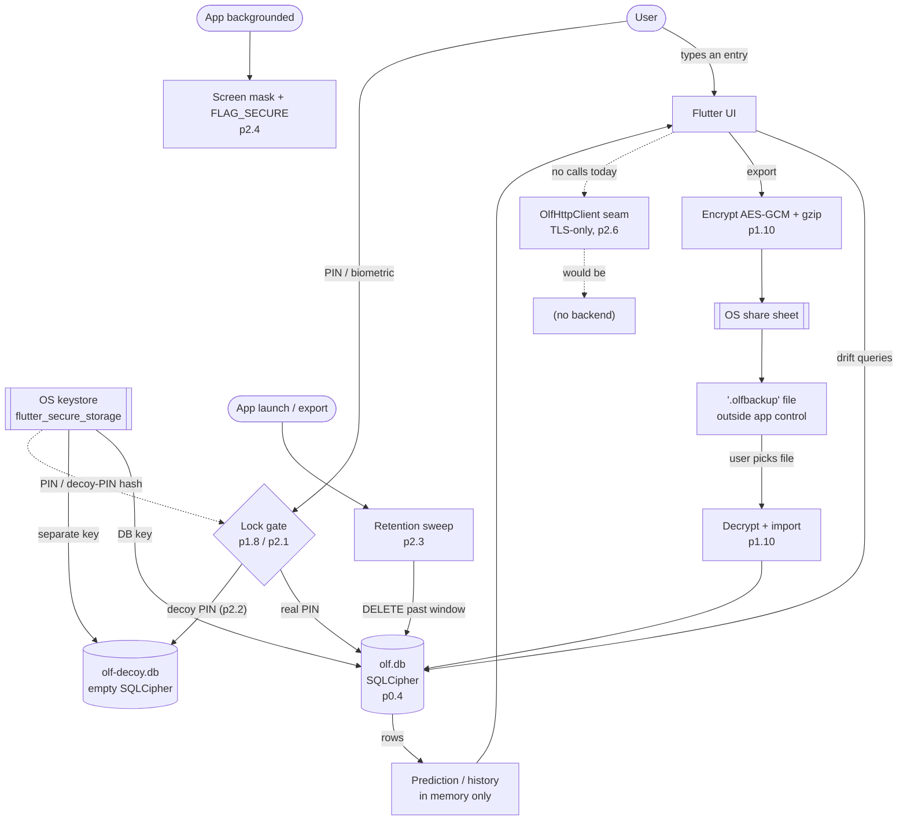

# Threat model & data-flow (p2.8)

`requirements.md` §3 (privacy & data security), §7 (duress / coercion), §8
(accessibility of the security model — it has to be understandable). This is a
**living document**: it is reviewed at every phase gate and the review is
recorded in the [Review log](#review-log) at the end. A CI guard
(`core/test/threat_model_doc_test.dart`) fails the build if this file loses a
required section, its Mermaid diagram, or a Review-log entry for the current
phase.

olf is a **local-only, no-account** cycle tracker. There is no backend, no
sign-in, and no network traffic today (the transport-security baseline in p2.6
is groundwork for a *possible* future sync). That single architectural choice
removes most of the classic attack surface — there is no server to breach, no
account to phish, no traffic to intercept — and concentrates what remains on
**the device itself**.

---

## Assets

What an adversary would want, roughly in order of sensitivity.

| Asset | Where it lives | Why it matters |
|---|---|---|
| Cycle & health entries (periods, flow, symptoms, BBT, mucus, meds, pregnancy-loss / birth events) | `olf.db`, an SQLCipher-encrypted drift database in app-private storage | The core secret. Can imply pregnancy, pregnancy loss, contraception use, sexual activity, transition-related care. |
| The database encryption key | OS keystore via `flutter_secure_storage` (Android Keystore / iOS Keychain), never in the DB or prefs | Whoever has this can read `olf.db` directly, no PIN needed. |
| PIN hash and decoy-PIN hash | `flutter_secure_storage` | Brute-forcing these bypasses the gate; the decoy hash also reveals that a decoy exists. |
| Preferences (theme, pronouns, reminder settings, retention window) | unencrypted `SharedPreferences` / `NSUserDefaults` | Low sensitivity on their own, but pronouns and a tight retention window are weak signals. |
| `.olfbackup` export files | wherever the user saved them via the OS share sheet — local disk, cloud drive, messaging app | Encrypted (AES-GCM, user passphrase), but now outside app control. |
| Derived predictions (next period, fertile window) | recomputed in memory from entries; not separately stored | Same sensitivity as the entries they come from. |
| Source repository & dependency graph | GitHub, `pubspec.lock` | A malicious dependency could exfiltrate any of the above from a future build. |

---

## Adversaries

| Adversary | Capability | In scope? |
|---|---|---|
| **Opportunistic snoop** | Picks up an unlocked, unattended phone for a minute. | Yes — the PIN/biometric gate (p1.8, p2.1) is the primary control. |
| **Coercing party** | Can compel the owner to unlock the phone or hand over the PIN (border, abusive partner, custody dispute). | Yes — the decoy PIN (p2.2) and the retention window (p2.3) are the controls. |
| **Device co-owner / abuser** | Shares the device day-to-day, may install things, watches over the owner's shoulder. | Yes — discreet theme (p1.9), background mask (p2.4), no PHI in notifications (p1.7 / §3), decoy vault (p2.2). |
| **Thief / finder** | Has the powered-off or locked device, no compulsion. | Yes — at-rest encryption (p0.4) + OS lock + the app gate. |
| **Another app / malware on the device** | Runs unprivileged in its own sandbox; may try the recents screenshot buffer, `MediaProjection`, or reading world-readable files. | Partly — `FLAG_SECURE` + the app-switcher mask (p2.4), app-private storage, key in the keystore. A rooted/jailbroken device is out of scope. |
| **Network attacker** | On-path for a future sync call; MITM proxy, hostile Wi-Fi. | Pre-mitigated — no traffic today; TLS-only config + `OlfHttpClient` chokepoint (p2.6) so the first sync inherits a hardened default. |
| **Supply-chain attacker** | Gets a malicious package (or version) into the dependency graph. | Yes — the CI dependency-audit denylist + locked graph (p0.3), promoted to an un-waivable release blocker in p2.9. |
| **Legal process** | Subpoena / warrant to the developer or a civil discovery request. | Yes — there is no account, log, or server-side copy to produce; the privacy policy (p2.5) and the in-app explainer (p2.7) state this plainly. |

**Explicitly out of scope:** a nation-state adversary with a zero-day against
the OS or the secure enclave; a forensic lab with chip-off / JTAG access to a
seized device; a compromised OS or a rooted/jailbroken device (the keystore and
`FLAG_SECURE` guarantees no longer hold); rubber-hose attacks that go past the
decoy (the owner is compelled to reveal that a decoy exists). These are noted
so the boundary is honest, not because they are unimportant.

---

## Trust boundaries

1. **OS keystore ↔ app process.** The app asks the keystore to create/return
   the DB key; it trusts the OS to gate that on device unlock and to keep the
   key out of other apps. Crossing point: `flutter_secure_storage`.
2. **App process ↔ `olf.db` on disk.** In-process the data is plaintext; on
   disk it is SQLCipher-encrypted. Crossing point: the drift/SQLCipher layer
   (p0.4).
3. **Locked app ↔ unlocked app.** The PIN/biometric gate (p1.8, p2.1) runs
   *before* the database is opened; the decoy PIN (p2.2) routes to a physically
   separate database file. Crossing point: the lock screen + vault selection.
4. **App ↔ OS share sheet / file picker.** Export hands an encrypted blob to
   the OS; restore reads a user-chosen file. Once exported, the file is outside
   olf's control. Crossing point: the `BackupFileGateway` seam (p1.10).
5. **App ↔ screen / recents buffer.** When the app is backgrounded or
   inactive, the OS may snapshot the screen. Crossing point: the lifecycle
   listener + `FLAG_SECURE` / native cover (p2.4).
6. **App ↔ network.** No traffic today. The only sanctioned path is
   `OlfHttpClient` (p2.6), which refuses non-HTTPS before a socket opens.
7. **Repo ↔ dependency graph.** Every transitive package is trusted at build
   time. Crossing point: `pubspec.lock` + the CI dependency-audit (p0.3, p2.9).

---

## Data flow



ASCII fallback (same flow, for viewers without Mermaid):

```
              +-----------+     PIN / biometric      +----------------------+
   User  ---> | Flutter UI| ---> [ Lock gate ] ---->  |  real PIN            |
              +-----------+       p1.8 / p2.1         |    -> olf.db         |
                   |  ^                               |       (SQLCipher,p0.4)
        drift      |  | predictions (in memory)       |  decoy PIN (p2.2)    |
        queries    v  |                               |    -> olf-decoy.db   |
              +----------------+                      +----------------------+
              |  olf.db        | <--- DB key --- [ OS keystore / secure storage ]
              +----------------+                       (also holds PIN hashes)
                   |   ^
   launch/export   |   | import
   [ retention     |   |
     sweep p2.3 ]--+   |
                   |   |
             export v  | 
        [ encrypt AES-GCM + gzip, p1.10 ] --> [ OS share sheet ] --> .olfbackup
                                                                     (outside app)
   app backgrounded --> [ screen mask + FLAG_SECURE, p2.4 ]

   network: none today. Only path = OlfHttpClient (TLS-only, p2.6) --> (no backend)
```

---

## Mitigations

Every privacy/security control shipped in Phases 0–2, mapped to the slice that
introduced it and the boundary or adversary it addresses. This table is the
cross-reference the phase-gate review walks.

| Control | Slice | Addresses |
|---|---|---|
| No account, no sign-in, local-only store | p0.4 | removes server breach / account phishing / subpoena-to-server entirely |
| SQLCipher encryption at rest | p0.4 | thief / finder; another app reading files |
| CI dependency-audit denylist + locked graph + branch protection | p0.3 | supply-chain attacker; enforces "zero ad/analytics SDK" (§3) |
| Anonymous-by-default + local PIN gate + disclaimers + first-run privacy explainer | p1.8 | opportunistic snoop; sets user expectations honestly (§6) |
| Discreet dark theme baseline | p1.9 | shoulder-surfing co-owner |
| Encrypted backup / restore (`.olfbackup`, AES-GCM + gzip, user passphrase) | p1.10 | keeps the export secret once it leaves the app |
| No PHI in reminder notification text | p1.7 / §3 | notifications visible on a locked screen |
| Biometric unlock layered on the PIN | p2.1 | faster gate → users actually keep it on |
| Decoy / duress PIN → separate empty vault | p2.2 | coercing party; border / custody compulsion (§7) |
| Scheduled auto-deletion (retention window + purge-before-export) | p2.3 | limits what a seized device can reveal; "delete means delete" (§9(11)) |
| Background app-switcher mask + `FLAG_SECURE` + no-PHI recents | p2.4 | another app / `MediaProjection`; recents snapshot |
| Standalone consumer-health privacy policy + opt-in consent switches (default off) | p2.5 | MHMDA / Nevada SB370 alignment; "we never sell / require legal process" (§3, §6) |
| TLS-only platform config + `OlfHttpClient` chokepoint + transport gate | p2.6 | future network attacker; prevents a later feature silently using cleartext |
| In-app privacy education (HIPAA gap, law-enforcement reality, how to delete everything) | p2.7 | the ~9%-take-action finding; corrects the "HIPAA covers this" misconception (§3, §9(8)) |
| This threat model + its CI guard | p2.8 | keeps the security design written down and reviewed each phase |

---

## Residual risks

Known gaps, carried from the per-slice `§9` follow-up notes in
`DEVELOPMENT_PLAN.md`. None block Phase 2; each is a candidate for a later
hardening slice.

- **The DB key is not bound to the PIN.** Each vault's SQLCipher key sits in
  secure storage independent of its PIN. An attacker with a secure-storage dump
  does not need the PIN; an attacker with the decoy PIN still cannot reach the
  real key. Binding the key to the PIN with a real KDF is the open item
  (p1.8 / p2.1 / p2.2 carry-over).
- **No failed-attempt lockout or backoff** on the PIN or the biometric retry
  (p2.1 / p2.2).
- **PIN hashing runs on the main isolate** at a modest work factor (p1.8).
- **iOS screenshots and screen recordings are not blocked** — no OS API; only
  the app-switcher snapshot is covered (p2.4).
- **Turning the decoy PIN off leaves `olf-decoy.db` on disk**, just unreachable;
  there is no "wipe the decoy space" action (p2.2).
- **The decoy vault opens with default preferences**, which a heavily
  customised real app might contrast with (p2.2).
- **Already-saved `.olfbackup` files are not retro-scrubbed** by the retention
  sweep — the app keeps no registry of where exports were saved (p2.3, §9(11)).
- **No background/periodic retention sweep** — it runs on launch, window
  change, and before export only (p2.3).
- **Certificate pinning is designed, not enforced** — `OlfHttpClient
  .certificatePins` is empty and `_checkPins` throws for any host added to it,
  so the first real backend host must wire enforcement (p2.6).
- **The delete explainer describes uninstall but cannot perform it** — there is
  no in-app "wipe everything now" button (p2.7).
- **Out-of-scope adversaries** (nation-state OS 0-day, forensic chip-off,
  rooted device, rubber-hose past the decoy) are accepted, not mitigated.

---

## Review log

Each phase gate: walk the [Mitigations](#mitigations) table against what
shipped, refresh [Residual risks](#residual-risks), and add a dated line here.
The CI guard requires an entry naming the current phase.

- **2026-08-31 — Phase 2 gate — reviewer: worker: phase2.** Initial version.
  Assets, adversaries, trust boundaries, and the data-flow diagram reflect the
  architecture as of `a7585fe` (Phase 0 + Phase 1 + p2.1–p2.7 merged; p2.8 in
  review). Every Phase 0–2 privacy/security control is cross-referenced to its
  slice in the Mitigations table. Residual risks seeded from the per-slice
  `§9` follow-up notes. No design changes required by this review; the open
  items are all already tracked as `§9` follow-ups.
- **2026-08-31 — Phase 3 opening gate — reviewer: worker: phase3.** Phase 3
  (correctable adaptive prediction engine v2) is pure-Dart computation in
  `core/` — a backtesting library (p3.1), an adaptive estimator (p3.2+), and an
  on-device private metrics view (p3.5). It introduces **no new asset, no new
  trust boundary, and no new data flow**: predictions are still derived-on-read
  from the same encrypted `olf.db`; the synthetic backtest datasets are
  generated in memory from a seeded RNG and never persisted; the opt-in
  real-data backtest reads the user's own DB behind an explicit action and its
  results never leave the device; nothing here touches the network, and the
  no-analytics / no-telemetry rule is unchanged. Assets, adversaries, trust
  boundaries, and the data-flow diagram are unchanged. Watch item for later
  slices: if p3.2/p3.3 persist model state or a correction-event log, that adds
  a table to the encrypted DB (still inside the existing app ↔ DB boundary) and
  must ship a migration — no new boundary, but record it here when it lands. No
  design changes required by this review.
- **2026-09-01 — Phase 3 closing gate — reviewer: worker: phase3.** All six
  slices p3.1–p3.6 shipped (PRs #35–#40). The watch item from the opening entry
  did **not** materialise: nothing in Phase 3 persists model state or a
  correction-event log. The adaptive engine (p3.2/p3.4) is pure on-device
  computation, derived-on-read from the same encrypted `olf.db` with no stored
  parameters; the p3.3 correction loop is in-memory session state only (the
  "what changed" note is recomputed on each edit — no persistence, **no schema
  change**); the p3.5 accuracy screen is a read-only backtest replay of the
  user's own history behind an explicit Settings action, with no network (unit-
  and scan-asserted) and no fabricated output; p3.6 is a one-line provider swap
  behind the unchanged `Predictor` seam. **No new asset, adversary, trust
  boundary, or data flow**; the data-flow diagram, Mitigations table, and
  Residual risks are unchanged. The Phase 3 `§9` follow-ups are all
  prediction-quality items, none security-relevant. No design changes required
  by this review.
